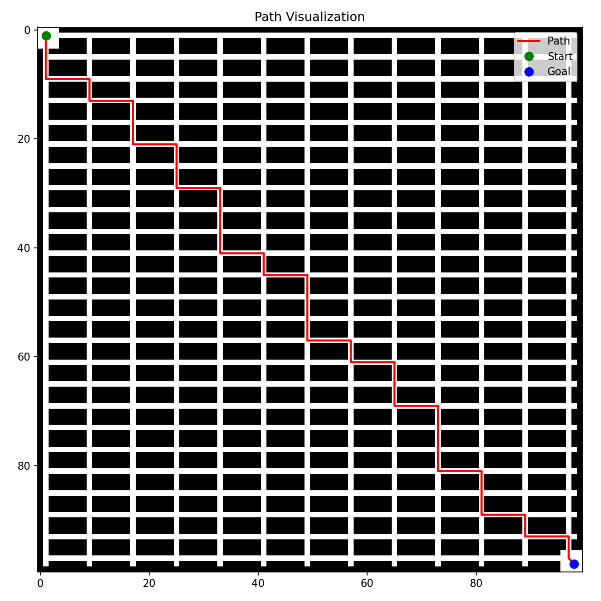
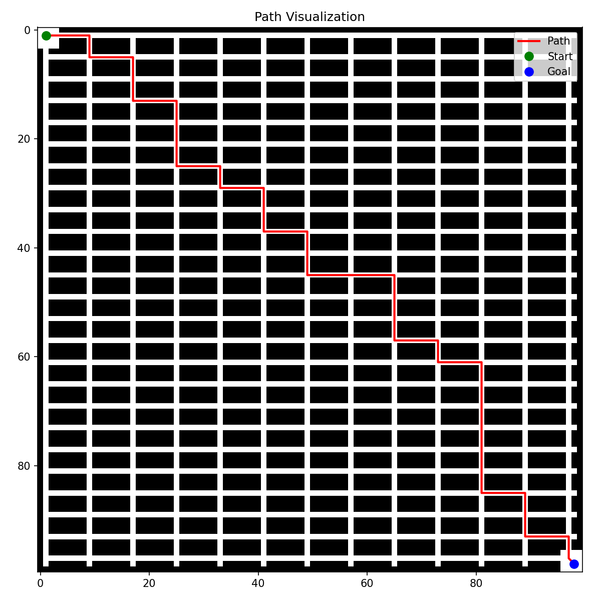
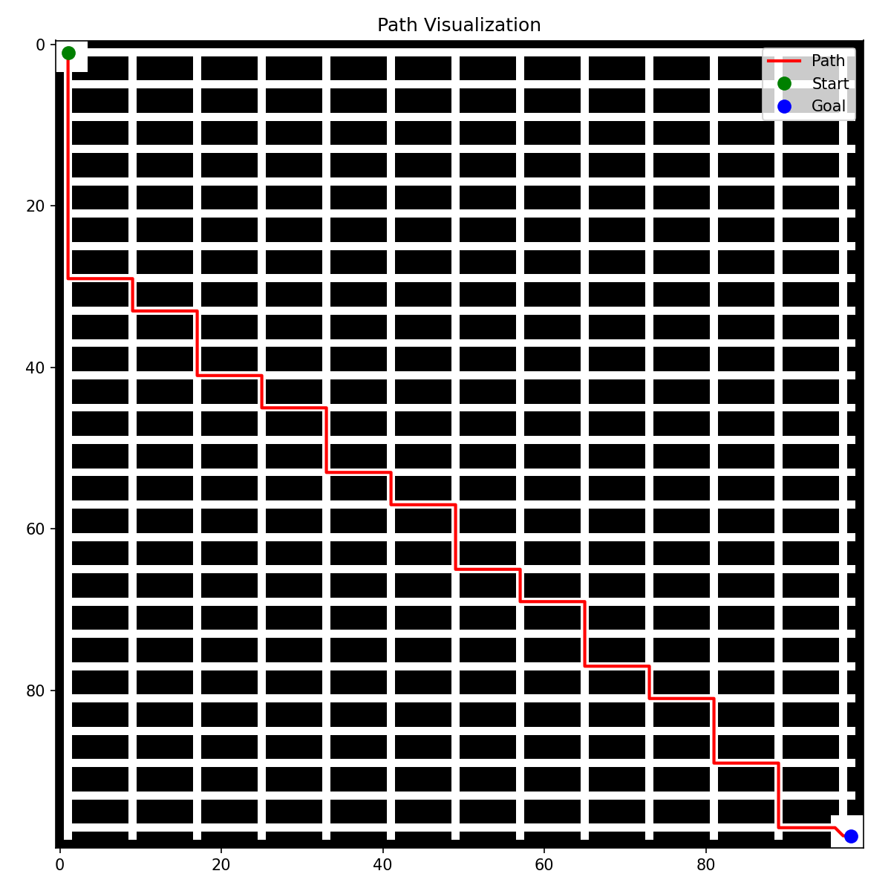
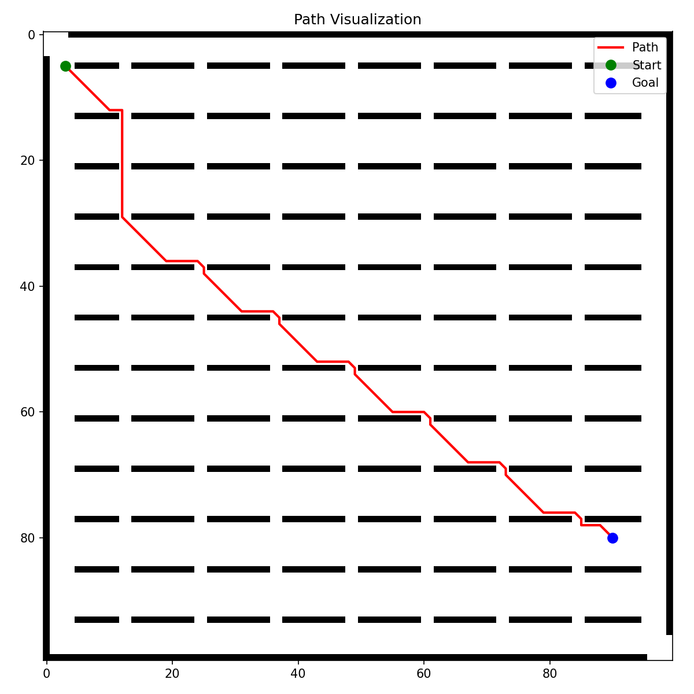
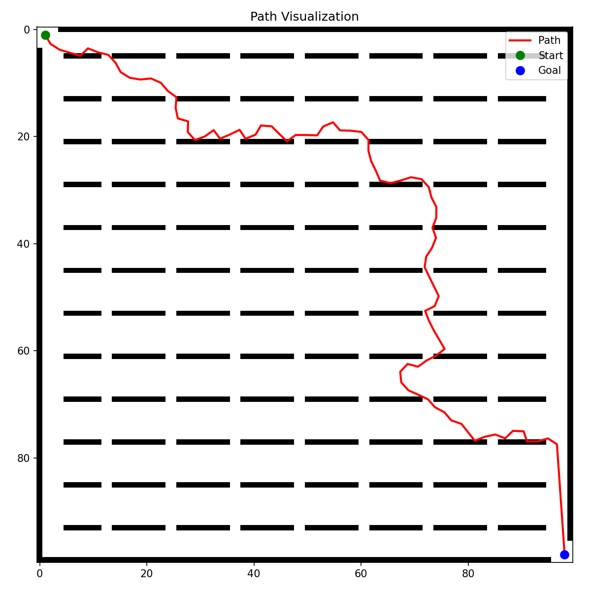
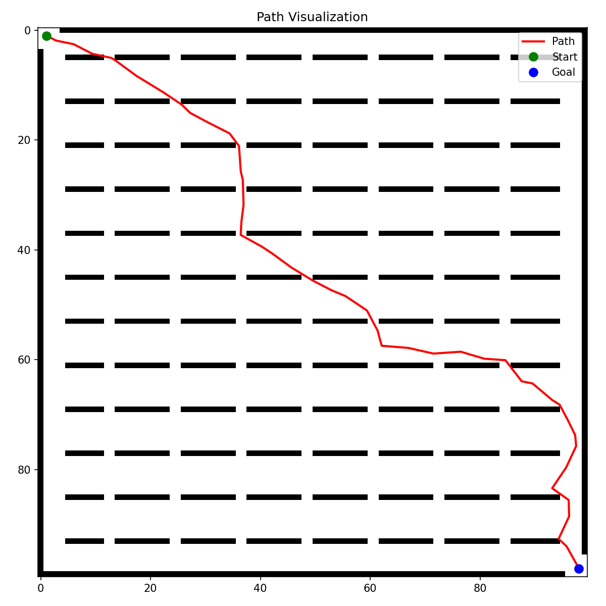
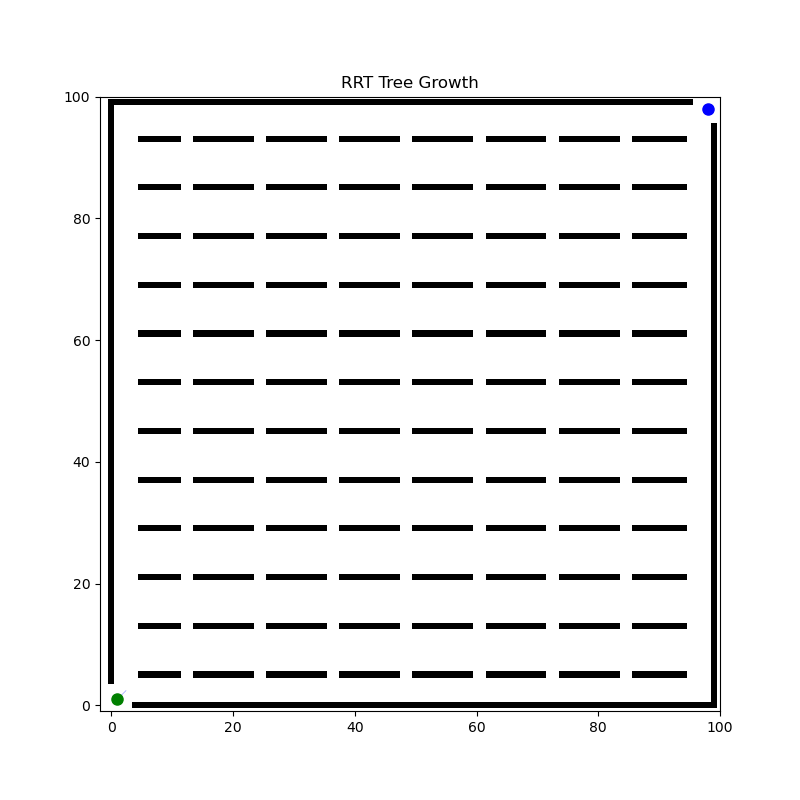
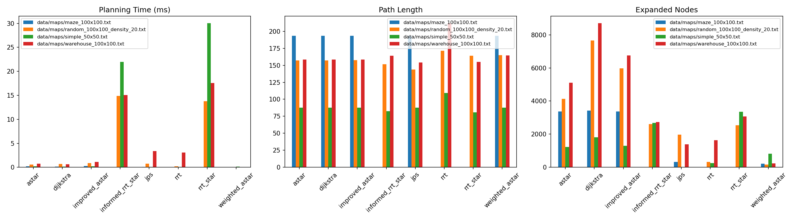
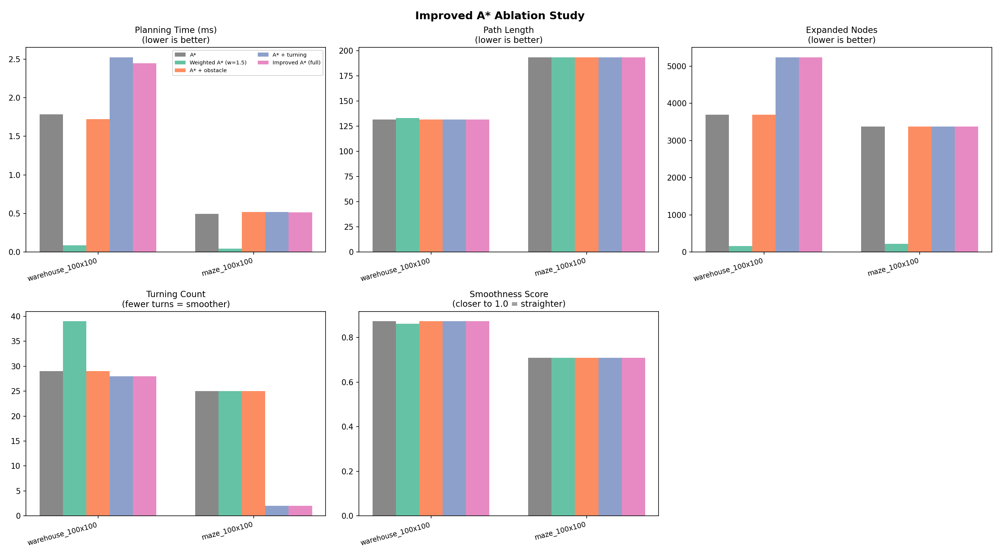

# AutoPlanner

A C++ path planning library for 2D mobile robot navigation.

## Overview

AutoPlanner provides a unified, extensible framework for path planning
algorithms — from classic graph search (Dijkstra, A\*, JPS) to sampling-based
planners (RRT, RRT\*), all behind a single `PlannerBase` interface.

**Key features:**

- **10 planning algorithms** — Dijkstra, A\*, Weighted A\*, Improved A\*,
  JPS, D\* Lite, RRT, RRT\*, Informed RRT\*, Bi-RRT, Hybrid A\*
- **Unified interface** — every planner shares `plan(map, start, goal) → result`
- **Costmap pipeline** — obstacle inflation, distance transform, risk-aware costs
- **Collision checking** — grid and line-based, pluggable into any planner
- **Path smoothing** — shortcut, Bezier, B-spline
- **Comprehensive metrics** — timing, path length, expanded nodes, smoothness,
  turning count, obstacle distance
- **Benchmark framework** — batch evaluation across maps, planners, and scenarios
- **Python tools** — map generation, path visualization, benchmark plotting
- **Clean C++17, header-only dependency free** — no Eigen, no OpenCV required

## Algorithms

| Family | Algorithms |
|--------|-----------|
| Graph Search | Dijkstra, A\*, Weighted A\*, Improved A\*, JPS, D\* Lite |
| Sampling | RRT, RRT\*, Informed RRT\*, Bi-RRT |
| Kinodynamic | Hybrid A\* |

**Improved A\*** extends the A\* cost function with obstacle proximity and
turning penalties:

```
f(n) = g(n) + w_h·h(n) + w_obs·obstacle_cost(n) + w_turn·turning_cost(n)
```

This produces paths that stay farther from obstacles and have fewer turns —
better suited for real robots.

See [docs/algorithms.md](docs/algorithms.md) for detailed descriptions.

## Demo Gallery

| A\* | Dijkstra | JPS |
|-----|----------|-----|
|  |  |  |

| Improved A\* | RRT | RRT\* |
|-------------|-----|-------|
|  |  |  |

### Smoothing

| Before | After Shortcut Smoothing |
|--------|--------------------------|
|  |  |

### RRT Tree Growth



### Benchmark



### Ablation Study — Improved A\*



## Project Structure

```
AutoPlanner/
├── include/autoplanner/    # Public headers
│   ├── core/               #   GridMap, Point, Path, PlannerBase, PlannerResult
│   ├── planners/           #   graph_search/ + sampling/ + kinodynamic/
│   ├── costmap/            #   Costmap2D, obstacle inflation
│   ├── collision/          #   CollisionChecker interface + implementations
│   ├── smoothing/          #   PathSmoother interface + implementations
│   ├── heuristics/         #   Manhattan, Euclidean, Diagonal
│   ├── metrics/            #   Path metrics, benchmark metrics
│   ├── io/                 #   Map loading, path writing, config loading
│   └── utils/              #   Timer, logger, math helpers
├── src/                    # Implementation files
├── apps/                   # CLI tools
│   ├── autoplanner_cli     #   General-purpose planner CLI
│   ├── run_single_planner  #   Single planner runner
│   └── compare_planners    #   Side-by-side comparison
├── examples/               # Self-contained demos
├── benchmark/              # Batch benchmark runner
├── tests/                  # Unit tests (Google Test)
├── scripts/                # Python utilities
├── data/                   # Maps and configuration
└── docs/                   # Documentation
```

## Quick Start

### Prerequisites

- C++17 compiler (GCC ≥ 8, Clang ≥ 7, MSVC ≥ 2019)
- CMake ≥ 3.16
- (optional) Python 3.10+ with matplotlib, numpy for visualization

### Build

```bash
cmake -S . -B build -DCMAKE_BUILD_TYPE=Release
cmake --build build -j
```

### Run a Planner

```bash
# A* on a simple map
./build/apps/autoplanner_cli \
    --planner astar \
    --map data/maps/simple_50x50.txt \
    --start 1 1 \
    --goal 48 48 \
    --output results/astar_demo

# RRT on a maze
./build/apps/autoplanner_cli \
    --planner rrt \
    --map data/maps/maze_100x100.txt \
    --start 1 1 \
    --goal 98 98 \
    --output results/rrt_demo

# Improved A* with obstacle inflation
./build/apps/autoplanner_cli \
    --planner improved_astar \
    --map data/maps/warehouse_100x100.txt \
    --start 3 5 \
    --goal 90 80 \
    --robot-radius 1.0 \
    --output results/improved_astar_demo

# Collision-safe shortcut smoothing
./build/apps/autoplanner_cli \
    --planner astar \
    --map data/maps/simple_50x50.txt \
    --start 1 1 \
    --goal 48 48 \
    --smooth shortcut \
    --output results/astar_smoothed
```

The planner CLI now supports every planner through one factory and can load
scalar parameters from YAML or `key=value` configuration files:

```bash
./build/apps/autoplanner_cli \
    --config data/configs/astar.yaml \
    --map data/maps/simple_50x50.txt \
    --start 1 1 --goal 48 48
```

Finite robot footprints are supported with conservative map inflation and
collision validation:

```bash
./build/apps/autoplanner_cli \
    --planner astar \
    --map data/maps/simple_50x50.txt \
    --start 5 5 --goal 45 45 \
    --footprint rectangle --robot-length 2.0 --robot-width 1.0 \
    --inflate --smooth shortcut \
    --output results/rectangle_robot
```

### Compare All Planners

```bash
./build/apps/compare_planners --map data/maps/warehouse_100x100.txt --start 1 1 --goal 98 98
```

### Dynamic Replanning with D* Lite

```bash
./build/apps/dynamic_replanning \
    --map data/maps/simple_50x50.txt \
    --frames 5 \
    --output results/dynamic_replanning.csv
```

The demo changes an occupied cell on the current route and reuses the D* Lite
search state to repair the path.

### Run Benchmark

```bash
./build/benchmark/benchmark_all
```

For repeatable experiments across maps, use the Python orchestration script
from the repository root:

```bash
python3 autoplanner/scripts/run_all_experiments.py \
    --build_dir build \
    --output_dir autoplanner/results/benchmark

python3 autoplanner/scripts/compare_results.py \
    autoplanner/results/benchmark/all_results.csv
```

The runner reads `metrics.json` generated by the C++ CLI instead of parsing
terminal output.

### Run Tests

```bash
cmake -S . -B build -DBUILD_TESTS=ON
cmake --build build -j
ctest --test-dir build --output-on-failure
```

### Run Examples

```bash
./build/examples/astar_example
./build/examples/improved_astar_example
./build/examples/rrt_example
./build/examples/rrt_star_example
./build/examples/smoothing_example
./build/examples/costmap_example
```

## Visualization (Python)

### Native Python Binding

Build the optional pybind11 module from the repository root:

```bash
cmake -S . -B build-python -DCMAKE_BUILD_TYPE=Release \
    -DBUILD_TESTS=OFF -DBUILD_PYTHON_BINDINGS=ON
cmake --build build-python -j
PYTHONPATH=build-python/python python3 -c \
  "import autoplanner; print(autoplanner.__doc__)"
```

Use `autoplanner.plan(...)` for a high-level call, or
`autoplanner.create_planner(...)` to reuse a configured C++ planner object.

```bash
# Visualize a planned path
python scripts/visualize_path.py \
    --map data/maps/maze_100x100.txt \
    --path results/path.csv \
    --output results/maze_path.png

# Generate a random map
python scripts/generate_random_map.py \
    --width 100 --height 100 --density 0.2 \
    --output data/maps/random_map.txt

# Plot benchmark results
python scripts/plot_benchmark.py results/benchmark/benchmark_all.csv
```

## API (Minimal Example)

```cpp
#include "autoplanner/autoplanner.h"
#include "autoplanner/planners/graph_search/astar.h"

int main() {
    using namespace autoplanner;

    GridMap map;
    map.loadFromTxt("data/maps/simple_50x50.txt");

    AStarPlanner astar(true);  // allow diagonals
    auto result = astar.plan(map, {1, 1}, {48, 48});

    if (result.success) {
        std::cout << "Path found! Length: " << result.path_length << "\n";
        savePathCsv(result.path, "output.csv");
        saveMetricsJson(result, "metrics.json");
    }
    return 0;
}
```

See [docs/api_reference.md](docs/api_reference.md) for the full API.

## Benchmark Highlights

| Planner | Time (ms) | Path Len | Nodes | Turns |
|---------|-----------|----------|-------|-------|
| Dijkstra | slow | optimal | many | many |
| A\* | fast | optimal | fewer | many |
| Weighted A\* | faster | slightly longer | even fewer | many |
| Improved A\* | moderate | safe | moderate | **fewer** |
| JPS | **fastest** | optimal | **fewest** | many |
| RRT | fast | variable | N/A | variable |
| RRT\* | slower | near-optimal | N/A | variable |

See [docs/benchmark_report.md](docs/benchmark_report.md) for details and
regeneration instructions.

## Documentation

- [Design document](docs/design.md) — architecture and design decisions
- [Algorithms](docs/algorithms.md) — detailed algorithm descriptions
- [API Reference](docs/api_reference.md) — complete class and function reference
- [Benchmark Report](docs/benchmark_report.md) — methodology and expected results

## License

MIT — see [LICENSE](LICENSE).
